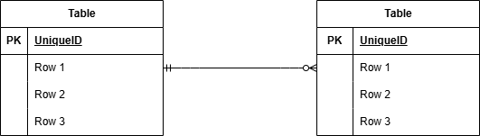

## アプリケーション名

お問い合わせフォーム

## 環境構築

```
リポジトリからダウンロード
git clone git@github.com:syagy/saga-kadai1.git

srcディレクトリにある「.env.example」をコピーして 「.env」を作成し DBの設定を変更
cp .env.example .env
---
DB_CONNECTION=mysql
DB_HOST=mysql
DB_PORT=3306
DB_DATABASE=laravel_db
DB_USERNAME=laravel_user
DB_PASSWORD=laravel_pass
---

dockerコンテナを構築
docker-compose up -d --build

Laravelをインストール
docker-compose exec php bash
composer install

アプリケーションキーを作成
php artisan key:generate

DBのテーブルを作成
php artisan migrate

DBのテーブルにダミーデータを投入
php artisan db:seed

"The stream or file could not be opened"エラーが発生した場合
srcディレクトリにあるstorageディレクトリに権限を設定
chmod -R 777 storage
```

## 使用技術(実行環境)

・PHP 8.1.33
・Laravel Framework 8.83.29
・mysql 8.0.26
・nginx 1.21.1

## URL

お問い合わせフォーム：http://localhost/

## ER 図



```

```
